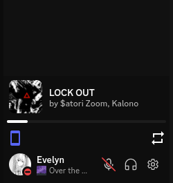

  <h1 align="center">SpotifyModal</h1>

  
  
  
  

  

  A Post-SWC Replugged plugin that shows a little modal on your user dock that lets you see & control
what you're playing on Spotify.

> **Note**  
> This plugin does **not** require Spotify Premium to function.
> All functionality are built upon Discord's Spotify WebSocket + Spotify WebAPI calls

<h2 align="center">How to use</h2>

- Link your Spotify account to Discord if you haven't already  
- Play any Spotify song (that's literally it)

<h2 align="center">Preview</h2>

<h2 align="center">Customization & debugging</h2>

There exists a settings menu which allows for a certain degree of customization.  
You can also customize how the modal looks via CSS:
- React Root: `spotify-modal-root`
- Main modal: `spotify-modal`
  - Header: `header`
    - Cover art: `cover-art`
    - Track info container: `track-info`
      - Song title: `title`
      - Artists list: `artists`
        - Artist with hyperlink: `artist`
  - Dock: `dock`
    - Progress display container: `progress-display`
      - Current time display: `current`
      - Duration time display: `duration`
    - Progress bar: `seek-bar`
      - Inner progress bar: `inner`
    - Controls container: `controls`
      - Shuffle icon: `shuffle`
      - Skip previous icon: `skip-prev`
      - Play/pause icon: `play-pause`
      - Skip next icon: `skip-next`
      - Repeat icon: `repeat`

<h2 align="center">Known issues</h2>

- Leaving Spotify inactive for an hour or so will make the controls stop working until you manually update the player state in the Spotify app  
- The progress bar is very sensitive to lag (heavy system load / renderer freezing), causing inaccuracy  
- The modal can fade out at random when the player state updates (pre-better-codebase bug)  
- The title element does not play the scrolling animation (when it's supposed to) on Discord startup, instead it cuts out (ellipsis)  

<h2 align="center">Miscellaneous</h2>

- Right clicking on the cover art copies the currently playing album URL, if there's any
- Right clicking on the song title copies the currently playing song's URL
- Right clicking on an artist's name copies the artist's user URL
- Clicking on the progress bar allows you to set current playback position

<h2 align="center">Roadmap</h2>

- [x] Add basic functionality
- [x] Song progress bar
- [ ] Controls
  - [x] Play/pause
  - [x] Skip forwards/backwards
  - [x] Toggle shuffle
  - [x] Change repeat mode
  - [ ] Track seeking
    - [x] Track seeking by clicking on bar
    - [ ] Track scrubbing
  - [ ] Volume control
- [x] Styling improvements
